# PES-VCS — Version Control System

## Author

- **Name:** Vaibhav R
- **SRN:** PES2UG24CS664

---

# Project Overview

This project implements a simplified Git-like Version Control System using content-addressable storage, tree structures, and commit history.

---

# ⚙️ Build Instructions

```bash
make
make test_objects
make test_tree
make test-integration
```

---

# Phase 1 — Object Storage

## ✔ Output

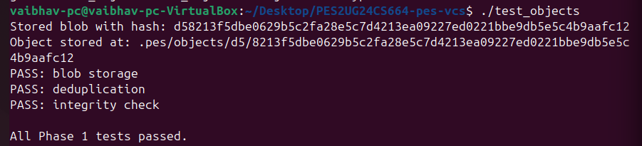

## ✔ Object Storage Structure

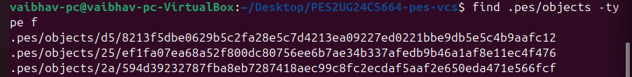

### Explanation

- Files stored as blobs using SHA-256
- Deduplication ensures same content is stored once
- Integrity verified using hash comparison

---

# Phase 2 — Tree Objects

## ✔ Test Output

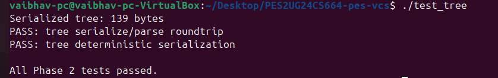

## ✔ Tree Binary Format

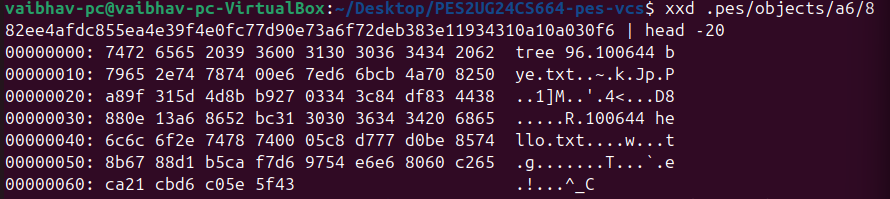

### Explanation

- Trees represent directory structure
- Entries contain mode, filename, and hash
- Serialization is deterministic

---

# Phase 3 — Index (Staging Area)

## ✔ Status Output

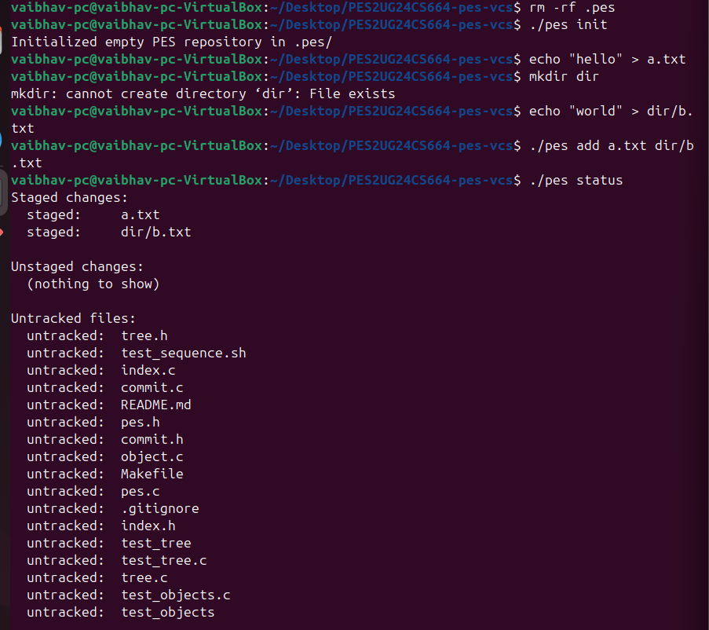

## ✔ Index File

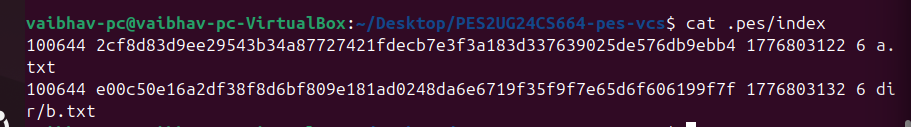

### Explanation

- Index stores staged files
- Contains metadata: mode, hash, size, mtime
- Sorted and saved atomically

---

# Phase 4 — Commits

## ✔ Commit Log

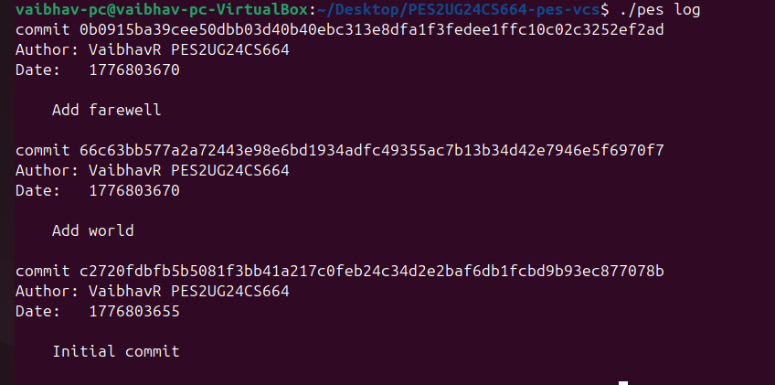

## ✔ Object Growth

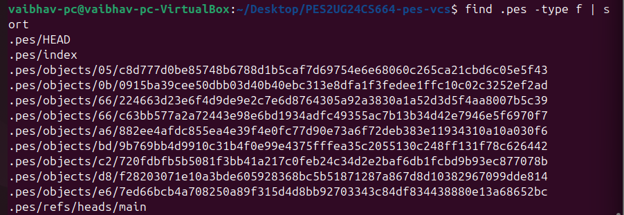

## ✔ HEAD and References

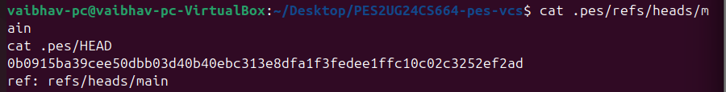

### Explanation

- Commit stores snapshot via tree hash
- Parent pointer links history
- HEAD points to current branch

---

# Integration Test

## ✔ Output

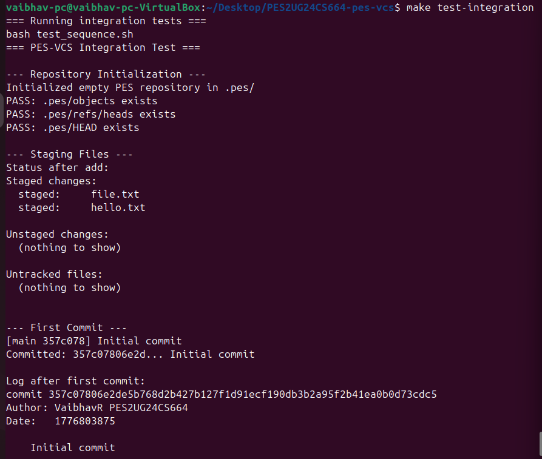

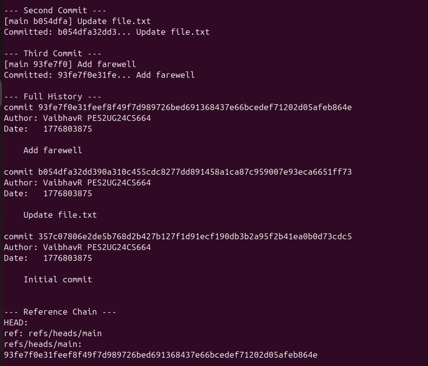

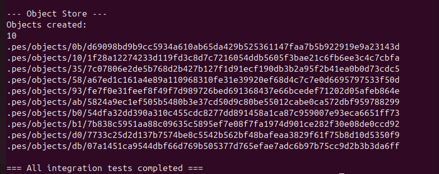

### Explanation

- Full workflow tested
- All components integrated successfully

---

# 🧠 Analysis Questions

## Q5.1 — A branch in Git is just a file in .git/refs/heads/ containing a commit hash. Creating a branch is creating a file. Given this, how would you implement pes checkout <branch> — what files need to change in .pes/, and what must happen to the working directory? What makes this operation complex?

To implement pes checkout <branch>, three main things must happen. First, the .pes/HEAD file must be updated to contain ref: refs/heads/<branch>. Second, the system must read the target branch's commit hash, find its root tree, and update the .pes/index to match this new snapshot. Finally, the working directory must be updated by deleting files that don't exist in the new branch, creating new ones, and overwriting changed ones. The complexity comes from ensuring we do not accidentally overwrite a user's unsaved changes during this working directory update.

---

## Q5.2 — When switching branches, the working directory must be updated to match the target branch's tree. If the user has uncommitted changes to a tracked file, and that file differs between branches, checkout must refuse. Describe how you would detect this "dirty working directory" conflict using only the index and the object store.

To detect a "dirty" working directory, the system must compare the file metadata (size and modification time via stat) in the working directory against the metadata stored in .pes/index. If a file has uncommitted modifications, the system must then check if that specific file differs between the current branch's tree and the target branch's tree. If the file is modified and the target branch has a different version of that file, the checkout must abort to prevent silently destroying the user's uncommitted work.

## Q5.3 — "Detached HEAD" means HEAD contains a commit hash directly instead of a branch reference. What happens if you make commits in this state? How could a user recover those commits?

A "Detached HEAD" occurs when the .pes/HEAD file contains a raw commit hash instead of a branch reference (e.g., ref: refs/heads/main). If a user makes commits in this state, the new commit objects are created and HEAD is updated to the new hash, but no branch pointer is moved. If the user then checks out another branch, those new commits become "orphaned" because no branch points to them. A user can recover them by creating a new branch that points directly to the detached commit hash (e.g., git checkout -b <new-branch-name> <hash>).

---

## Q6.1 — Over time, the object store accumulates unreachable objects — blobs, trees, or commits that no branch points to (directly or transitively). Describe an algorithm to find and delete these objects. What data structure would you use to track "reachable" hashes efficiently? For a repository with 100,000 commits and 50 branches, estimate how many objects you'd need to visit.

To delete unreachable objects, I would use a "Mark-and-Sweep" algorithm. First, create a hash set to track "reachable" objects. Start at all branch pointers in .pes/refs/heads/ and .pes/HEAD. Traverse backward through every commit's parent pointer. For every commit visited, traverse its root tree, sub-trees, and blobs, marking every encountered hash as reachable. In the "Sweep" phase, iterate through all files in .pes/objects/. If a file's hash is not in the reachable set, delete it. For 100,000 commits and 50 branches, you would only need to visit the unique objects, meaning deduplication naturally limits the traversal to only the exact number of unique files, trees, and commits ever created in the repo's history.

---

## Q6.2 — Why is it dangerous to run garbage collection concurrently with a commit operation? Describe a race condition where GC could delete an object that a concurrent commit is about to reference. How does Git's real GC avoid this?

Running GC concurrently with a commit is dangerous because of the time gap between creating an object and linking it. When a user runs pes commit, the system writes new blobs and trees to .pes/objects/. If GC runs exactly at this moment, it will scan the branches, see that these brand-new objects are not yet linked to any commit, and aggressively delete them. A fraction of a second later, the commit finishes and points to objects that no longer exist, permanently corrupting the repository. Real Git avoids this by using a grace period: its GC will only delete unreachable objects if they are older than a specific threshold (e.g., 2 weeks old), safely ignoring recently created objects that might be part of an active process.

---

# 📁 Files Implemented

- object.c
- tree.c
- index.c
- commit.c

---

# Commit History Requirement

✔ Minimum 5 commits per phase
✔ Proper commit messages maintained

---

# Final Status

✔ All phases completed
✔ All tests passed
✔ Integration successful

---

# Conclusion

This project demonstrates how Git internally works using hashing, trees, and commits. It provides practical understanding of version control systems and filesystem design.

---
